# learnship


<p align="center">
  <a href="https://github.com/FavioVazquez/learnship/actions/workflows/ci.yml"></a>
  <a href="https://www.npmjs.com/package/learnship"></a>
  <a href="LICENSE"></a>
  <a href="https://github.com/FavioVazquez/learnship/stargazers"></a>
  
  
</p>

<p align="center">
  <strong>Agentic engineering done right.</strong><br>
  <a href="#install">Install</a> ·
  <a href="#what-is-learnship">What is learnship?</a> ·
  <a href="#how-it-works">How it works</a> ·
  <a href="#workflow-reference">Workflows</a> ·
  <a href="#configuration">Configuration</a> ·
  <a href="CONTRIBUTING.md">Contributing</a> ·
  <a href="CHANGELOG.md">Changelog</a>
</p>

---

## What is learnship?

**learnship** is a Windsurf-native platform for **agentic engineering** — the discipline of working with AI agents deliberately, with structure, context, and intent.

It is the direct opposite of vibe coding.

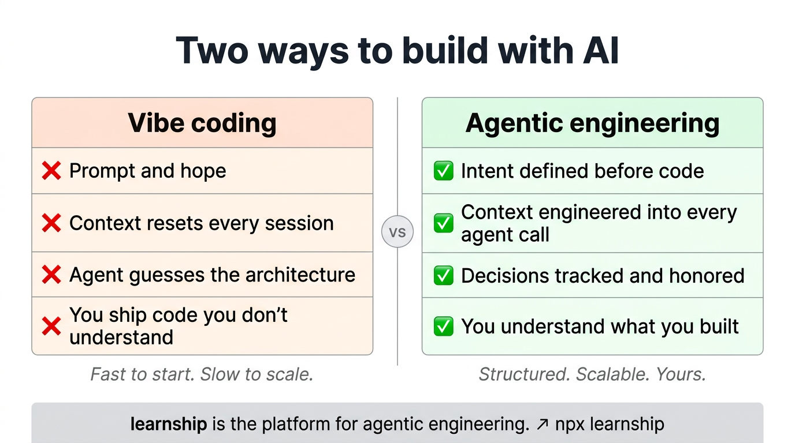

**Vibe coding** is fast and fun — you describe something, an agent generates it, you move on. The problem: you accumulate software you don't understand, decisions that were never made consciously, and context that evaporates between sessions. The agent starts each conversation blind. You lose ownership of your own codebase.

**Agentic engineering** is different. It treats AI agents as powerful collaborators that need — and deserve — proper context, clear specifications, and structured feedback loops. It means:

- **Intent over prompts.** You define what you're building and why before any code is written. Requirements, architecture decisions, phase scope — all captured, all readable by the agent.
- **Context engineering.** Every agent invocation is loaded with the right context: project goals, prior decisions, current phase, tech stack, conventions. Nothing is guessed.
- **Judgment as a first-class concern.** The platform surfaces decisions explicitly — what to build, how to build it, what to defer — so you stay in control of the direction.
- **Learning as a byproduct of building.** Understanding what you built, why it works, and what trade-offs were made is not optional. It's part of the process.


learnship provides the structure for all of this: 40 workflows that implement the full agentic engineering lifecycle, a neuroscience-backed learning partner woven into each phase transition, and a design system that prevents AI aesthetics from producing forgettable interfaces.

**You come out with a product you shipped and a codebase you understand.**

---

## How It Works

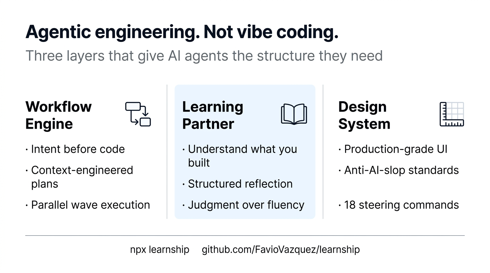

Three integrated layers that reinforce each other:

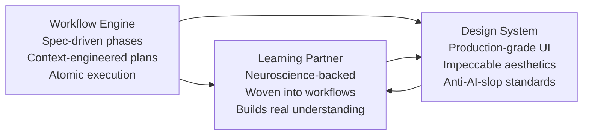

| Layer | What it does |
|-------|-------------|
| **Workflow Engine** | Breaks projects into spec-driven phases, creates executable plans, executes wave-ordered plans, verifies goals are met |
| **Learning Partner** | Offers neuroscience-backed learning actions at natural workflow transitions — retrieval, reflection, spacing, struggle |
| **Design System** | Provides design direction, anti-patterns, and steering commands for building distinctive, production-grade interfaces |

---

<a name="install"></a>
## Quick Start

### Install

```bash
# Recommended — runs directly from GitHub, no clone needed
npx github:FavioVazquez/learnship

# Or via curl
curl -fsSL https://raw.githubusercontent.com/FavioVazquez/learnship/main/install.sh | bash

# Or clone and run manually
git clone https://github.com/FavioVazquez/learnship.git
bash learnship/install.sh
```

Choose **global** to install to all Windsurf projects, or **local** for the current project only.

```bash
# Non-interactive flags
npx github:FavioVazquez/learnship --local     # current project only (.windsurf/)
npx github:FavioVazquez/learnship --global    # all Windsurf projects (~/.codeium/windsurf/)

# Uninstall
npx github:FavioVazquez/learnship --uninstall --local
npx github:FavioVazquez/learnship --uninstall --global
```

### Start a project

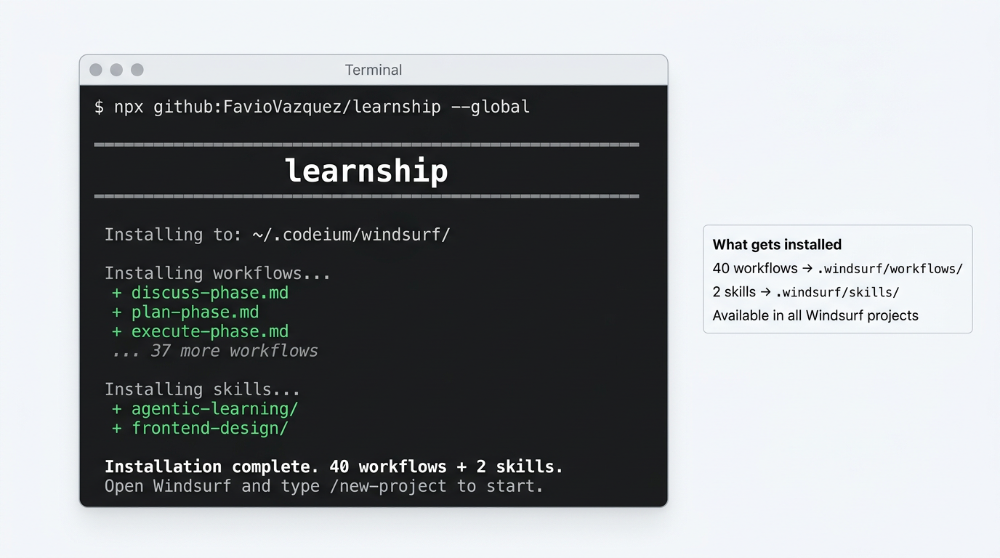

```
/new-project
```

Answer the questions. Approve the roadmap. Then follow the phase loop:

```
/discuss-phase 1  →  /plan-phase 1  →  /execute-phase 1  →  /verify-work 1
```

Repeat for each phase. When all phases are done: `/complete-milestone`.

---

## Full Project Lifecycle

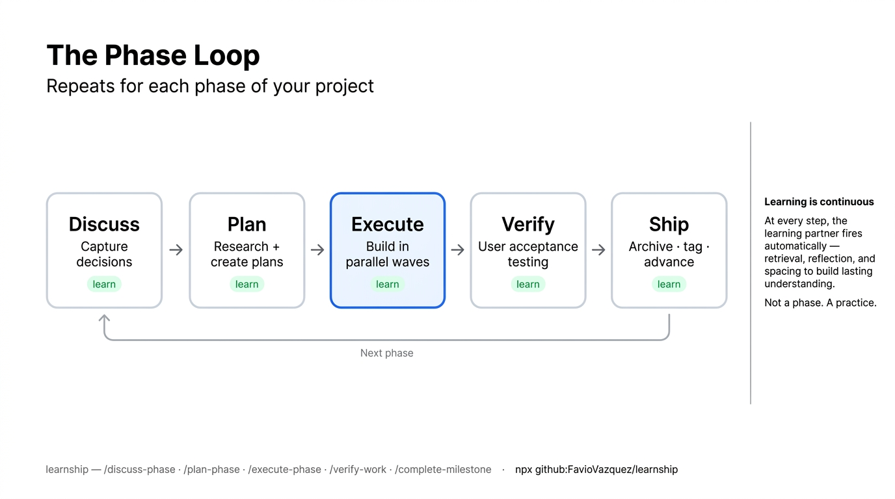

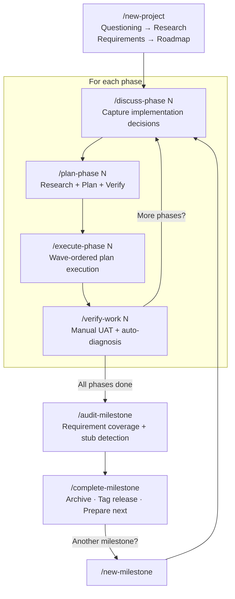

---

## Planning Agent Coordination

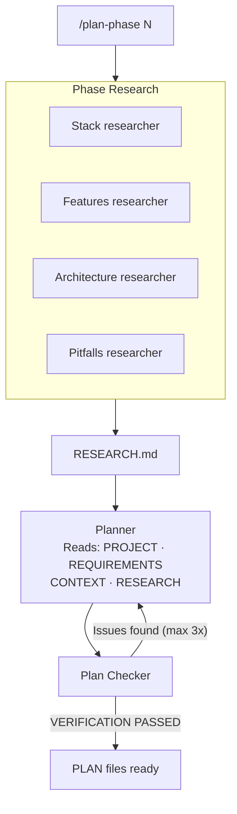

---

## Execution Wave Model

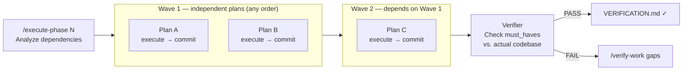

---

## Learning Checkpoint Map

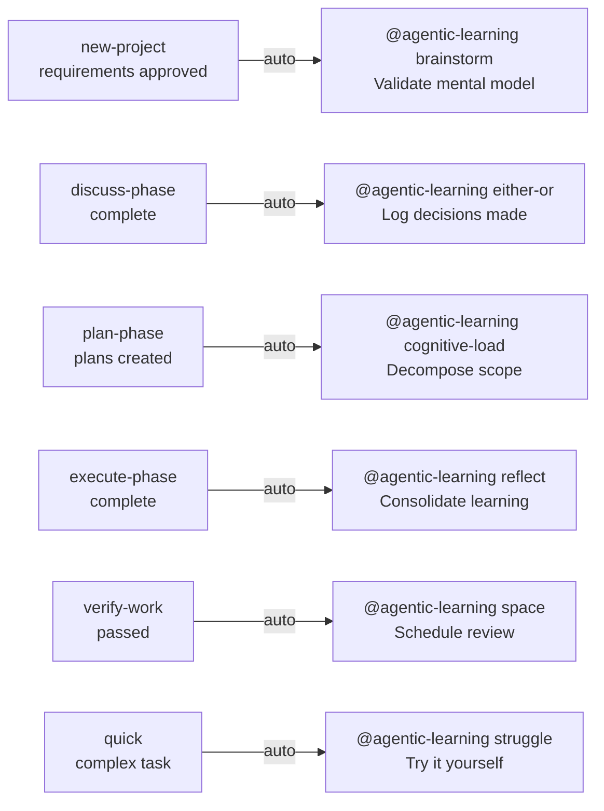

*Checkpoints fire automatically when `learning_mode: "auto"` (default). Set to `"manual"` to only trigger explicitly.*

---

## Quick Task Flow

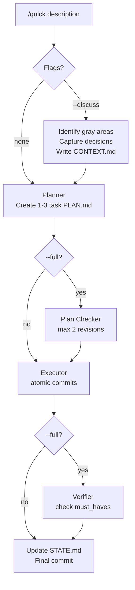

---

## Brownfield Workflow

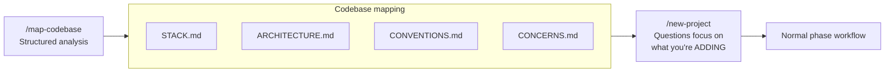

---

## Workflow Reference

### Core Workflow

| Workflow | Purpose | When to use |
|----------|---------|-------------|
| `/new-project` | Full init: questions → research → requirements → roadmap | Start of any new project |
| `/discuss-phase [N]` | Capture implementation decisions before planning | Before every phase |
| `/plan-phase [N]` | Research + create + verify plans | After discussing a phase |
| `/execute-phase [N]` | Wave-ordered execution of all plans | After planning |
| `/verify-work [N]` | Manual UAT with auto-diagnosis and fix planning | After execution |
| `/complete-milestone` | Archive milestone, tag release, prepare next | All phases verified |
| `/audit-milestone` | Pre-release: requirement coverage, stub detection | Before completing milestone |
| `/new-milestone [name]` | Start next version cycle | After completing a milestone |

### Navigation

| Workflow | Purpose | When to use |
|----------|---------|-------------|
| `/progress` | Status overview + smart routing to next step | "Where am I?" |
| `/resume-work` | Restore full context from last session | Starting a new session |
| `/pause-work` | Save handoff file mid-phase | Stopping mid-phase |
| `/quick [description]` | Ad-hoc task with full guarantees | Bug fixes, small features |
| `/help` | Show all available workflows | Quick command reference |

### Phase Management

| Workflow | Purpose | When to use |
|----------|---------|-------------|
| `/add-phase` | Append new phase to roadmap | Scope grows after planning |
| `/insert-phase [N]` | Insert urgent work between phases | Urgent fix mid-milestone |
| `/remove-phase [N]` | Remove future phase and renumber | Descoping a feature |
| `/research-phase [N]` | Deep research only, no plans yet | Complex/unfamiliar domain |
| `/list-phase-assumptions [N]` | Preview intended approach before planning | Validate direction |
| `/plan-milestone-gaps` | Create phases for audit gaps | After audit finds missing items |

### Brownfield, Discovery & Debugging

| Workflow | Purpose | When to use |
|----------|---------|-------------|
| `/map-codebase` | Analyze existing codebase | Before `/new-project` on existing code |
| `/discovery-phase [N]` | Map unfamiliar code area before planning | Entering complex/unfamiliar territory |
| `/debug [description]` | Systematic triage → diagnose → fix | When something breaks |
| `/diagnose-issues [N]` | Batch-diagnose all UAT issues — groups by root cause | After verify-work finds multiple issues |
| `/execute-plan [N] [id]` | Run a single plan in isolation | Re-running a failed plan |
| `/add-todo [description]` | Capture an idea without breaking flow | Think of something mid-session |
| `/check-todos` | Review and act on captured todos | Reviewing accumulated ideas |
| `/add-tests` | Generate test coverage post-execution | After executing a phase |
| `/validate-phase [N]` | Retroactive test coverage audit | After hotfixes or legacy phases |

### Decision Intelligence

| Workflow | Purpose | When to use |
|----------|---------|-------------|
| `/decision-log [description]` | Capture decision with context and alternatives | After any significant architectural choice |
| `/knowledge-base` | Aggregate all decisions and lessons into one file | Before starting a new milestone |
| `/knowledge-base search [query]` | Search the project knowledge base | When you need to recall why something was built a certain way |

### Milestone Intelligence

| Workflow | Purpose | When to use |
|----------|---------|-------------|
| `/discuss-milestone [version]` | Capture goals, anti-goals before planning | Before `/new-milestone` |
| `/milestone-retrospective` | 5-question retrospective + spaced review | After `/complete-milestone` |
| `/transition` | Write full handoff document for new session/collaborator | Before handing off or long break |

### Maintenance

| Workflow | Purpose | When to use |
|----------|---------|-------------|
| `/settings` | Interactive config editor | Change mode, toggle agents |
| `/set-profile [quality\|balanced\|budget]` | One-step model profile switch | Quick cost/quality adjustment |
| `/health` | Project health check | Stale files, missing artifacts |
| `/cleanup` | Archive old artifacts | End of milestone |
| `/update` | Update the platform itself | Check for new workflows |
| `/reapply-patches` | Restore local edits after update | After `/update` if you had local changes |

---

## Configuration

Project settings live in `.planning/config.json`. Set during `/new-project` or edit with `/settings`.

### Full Schema

```json
{
  "mode": "yolo",
  "granularity": "standard",
  "model_profile": "balanced",
  "learning_mode": "auto",
  "planning": {
    "commit_docs": true,
    "search_gitignored": false
  },
  "workflow": {
    "research": true,
    "plan_check": true,
    "verifier": true,
    "nyquist_validation": true
  },
  "git": {
    "branching_strategy": "none",
    "phase_branch_template": "phase-{phase}-{slug}",
    "milestone_branch_template": "{milestone}-{slug}"
  }
}
```

### Core Settings

| Setting | Options | Default | What it controls |
|---------|---------|---------|-----------------|
| `mode` | `yolo`, `interactive` | `yolo` | `yolo` auto-approves steps; `interactive` confirms at each decision |
| `granularity` | `coarse`, `standard`, `fine` | `standard` | Phase size: 3-5 / 5-8 / 8-12 phases |
| `model_profile` | `quality`, `balanced`, `budget` | `balanced` | Agent model tier (see table below) |
| `learning_mode` | `auto`, `manual` | `auto` | `auto` offers learning at checkpoints; `manual` requires explicit invocation |

### Workflow Toggles

| Setting | Default | What it controls |
|---------|---------|-----------------|
| `workflow.research` | `true` | Domain research before planning each phase |
| `workflow.plan_check` | `true` | Plan verification loop (up to 3 iterations) |
| `workflow.verifier` | `true` | Post-execution verification against phase goals |
| `workflow.nyquist_validation` | `true` | Test coverage mapping during plan-phase |

### Git Branching

| `branching_strategy` | Creates branch | Best for |
|---------------------|---------------|---------|
| `none` | Never | Solo dev, simple projects |
| `phase` | At each `execute-phase` | Code review per phase |
| `milestone` | At first `execute-phase` | Release branches, PR per version |

### Model Profiles

| Agent | `quality` | `balanced` | `budget` |
|-------|-----------|------------|---------|
| Planner | Opus | Opus | Sonnet |
| Executor | Opus | Sonnet | Sonnet |
| Phase Researcher | Opus | Sonnet | Haiku |
| Project Researcher | Opus | Sonnet | Haiku |
| Verifier | Sonnet | Sonnet | Haiku |
| Plan Checker | Sonnet | Sonnet | Haiku |
| Debugger | Opus | Sonnet | Sonnet |
| Codebase Mapper | Sonnet | Haiku | Haiku |

### Speed vs. Quality Presets

| Scenario | `mode` | `granularity` | `model_profile` | Research | Plan Check | Verifier |
|----------|--------|--------------|----------------|----------|------------|---------|
| Prototyping | `yolo` | `coarse` | `budget` | off | off | off |
| Normal dev | `yolo` | `standard` | `balanced` | on | on | on |
| Production | `interactive` | `fine` | `quality` | on | on | on |

---

## Learning Partner

The learning partner is woven into the platform, not bolted on. It fires at natural workflow transitions to build genuine understanding — not just fluent answers.

### How it fires

```
learning_mode: "auto"    → offered automatically at checkpoints (default)
learning_mode: "manual"  → only when you explicitly invoke @agentic-learning
```

### All 11 actions

| Action | Trigger | What it does |
|--------|---------|-------------|
| `@agentic-learning learn [topic]` | Any time | Active retrieval — explain before seeing, then fill gaps |
| `@agentic-learning quiz [topic]` | Any time | 3-5 questions, one at a time, formative feedback |
| `@agentic-learning reflect` | After `execute-phase` | Three-question structured reflection: learned / goal / gaps |
| `@agentic-learning space` | After `verify-work` | Schedule concepts for spaced review → writes `docs/revisit.md` |
| `@agentic-learning brainstorm [topic]` | After `new-project` | Collaborative design dialogue before any code |
| `@agentic-learning struggle [topic]` | During `quick` | Hint ladder — try first, reveal only when needed |
| `@agentic-learning either-or` | After `discuss-phase` | Decision journal — paths considered, choice, rationale |
| `@agentic-learning explain-first` | Any time | Oracy exercise — you explain, agent gives structured feedback |
| `@agentic-learning explain [topic]` | Any time | Project comprehension log → writes `docs/project-knowledge.md` |
| `@agentic-learning interleave` | Any time | Mixed retrieval across multiple topics |
| `@agentic-learning cognitive-load [topic]` | After `plan-phase` | Decompose overwhelming scope into working-memory steps |

**Core principle:** Fluent answers from an AI are not the same as learning. Every action makes you do the cognitive work — with support, not shortcuts.

---

## Design System

The **impeccable** skill suite is always active as project context for any UI work. It provides design direction, anti-patterns, and 17 steering commands that prevent generic AI aesthetics. Based on [@pbakaus/impeccable](https://github.com/pbakaus/impeccable).

### Commands

| Command | What it does |
|---------|-------------|
| `/teach-impeccable` | One-time setup — gathers project design context and saves persistent guidelines |
| `/audit` | Comprehensive audit: accessibility, performance, theming, responsive design |
| `/critique` | UX critique: visual hierarchy, information architecture, emotional resonance |
| `/polish` | Final quality pass — alignment, spacing, consistency before shipping |
| `/normalize` | Normalize design to match your design system for consistency |
| `/colorize` | Add strategic color to monochromatic or flat interfaces |
| `/animate` | Add purposeful animations and micro-interactions |
| `/bolder` | Amplify safe or boring designs — more visual impact |
| `/quieter` | Tone down overly aggressive designs — reduce intensity, gain refinement |
| `/distill` | Strip to essence — remove complexity, clarify what matters |
| `/clarify` | Improve UX copy, error messages, microcopy, labels |
| `/optimize` | Performance: loading speed, rendering, animations, bundle size |
| `/harden` | Resilience: error handling, i18n, text overflow, edge cases |
| `/delight` | Add moments of joy and personality that make interfaces memorable |
| `/extract` | Extract reusable components and design tokens into your design system |
| `/adapt` | Adapt designs across screen sizes, devices, and contexts |
| `/onboard` | Design onboarding flows, empty states, first-time user experiences |

**The AI Slop Test:** If you showed the interface to someone and said "AI made this" — would they believe you immediately? If yes, that's the problem. Use `/critique` to find out.

---

## Usage Examples

### New greenfield project

```
/new-project              # Answer questions, configure, approve roadmap
/discuss-phase 1          # Lock in your implementation preferences
/plan-phase 1             # Research + plan + verify
/execute-phase 1          # Wave-ordered execution
/verify-work 1            # Manual UAT
                          # Repeat for each phase
/audit-milestone          # Check everything shipped
/complete-milestone       # Archive, tag, done
```

### Existing codebase (brownfield)

```
/map-codebase             # Structured codebase analysis
/new-project              # Questions focus on what you're ADDING
# Normal phase workflow from here
```

### Quick bug fix

```
/quick "Fix login button not responding on mobile Safari"
```

### Quick with discussion + verification

```
/quick --discuss --full "Add dark mode toggle"
```

### Resuming after a break

```
/progress                 # See where you left off and what's next
# or
/resume-work              # Full context restoration + recommended action
```

### Scope change mid-milestone

```
/add-phase                # Append new phase to roadmap
/insert-phase 3           # Insert urgent work between phases 3 and 4
/remove-phase 7           # Descope phase 7 and renumber
```

### Preparing for release

```
/audit-milestone          # Check requirement coverage, detect stubs
/plan-milestone-gaps      # If audit found gaps, create phases to close them
/complete-milestone       # Archive, tag, done
```

### Debugging something broken

```
/debug "Login flow fails after password reset"
```

---

## AGENTS.md — Living Project Context

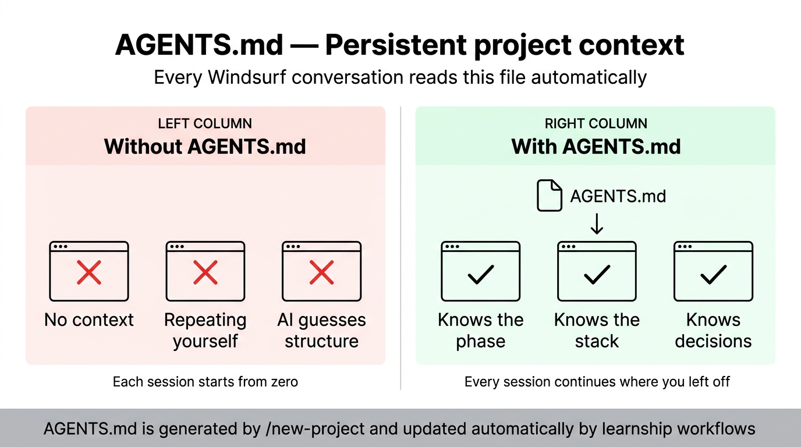

`new-project` generates an `AGENTS.md` at your project root. Windsurf reads it as a persistent system rule for every conversation, so Cascade always knows where the project stands — without you repeating yourself.

```
AGENTS.md                   ← Windsurf reads this every conversation
├── Soul & Principles        # Pair-programmer framing, 10 working principles
├── Platform Context         # Points to .planning/, explains the phase loop
├── Current Phase            # Updated automatically by workflows
├── Project Structure        # Filled during new-project from your answers
├── Tech Stack               # Filled from research results
└── Regressions              # Updated by /debug when bugs are fixed
```

**Auto-updated by the platform:**

| Trigger | What updates |
|---------|--------------|
| `plan-phase [N]` | Current Phase → "planning phase N" |
| `execute-phase [N]` | Current Phase → "executing phase N" |
| `debug` (session close) | Regressions section — root cause + lesson |
| `complete-milestone` | Current Phase → milestone shipped |
| `new-milestone` | Current Phase reset for new cycle |

---

## Decision Intelligence

Every project accumulates decisions — architecture choices, library picks, scope trade-offs. The platform tracks them in a structured register so future sessions understand *why* the project is built the way it is.

**`.planning/DECISIONS.md`** — the decision register:
```markdown
## DEC-001: Use Zustand over Redux
Date: 2026-03-01 | Phase: 2 | Type: library
Context: Needed client-side state for dashboard filters
Options: Zustand (simple, no boilerplate), Redux (complex, overkill for scope)
Choice: Zustand
Rationale: 3x less boilerplate, sufficient for current data flow complexity
Consequences: Locks React as UI framework; migration would require state rewrite
Status: active
```

**Populated automatically by:**
- `discuss-phase` — surfaces prior decisions before each phase discussion
- `plan-phase` — planner reads decisions before creating plans (never contradicts active ones)
- `debug` — architectural lessons from bugs go into the register
- `decision-log` — manual capture of any decision from any conversation

**Queried by:**
- `audit-milestone` — checks decisions were honored in implementation
- `knowledge-base` — aggregates all decisions into a searchable `KNOWLEDGE.md`

---

## Planning Artifacts

Every project creates a structured `.planning/` directory:

```
.planning/
├── config.json               # Workflow settings
├── PROJECT.md                # Vision, requirements, key decisions
├── REQUIREMENTS.md           # v1 requirements with REQ-IDs
├── ROADMAP.md                # Phase breakdown with status tracking
├── STATE.md                  # Current position, decisions, blockers
├── DECISIONS.md              # Cross-phase decision register
├── KNOWLEDGE.md              # Aggregated lessons (from knowledge-base)
├── research/                 # Domain research from new-project
│   ├── STACK.md
│   ├── FEATURES.md
│   ├── ARCHITECTURE.md
│   ├── PITFALLS.md
│   └── SUMMARY.md
├── codebase/                 # Brownfield mapping (from map-codebase)
│   ├── STACK.md
│   ├── ARCHITECTURE.md
│   ├── CONVENTIONS.md
│   └── CONCERNS.md
├── todos/
│   ├── pending/              # Captured ideas awaiting work
│   └── done/                 # Completed todos
├── debug/                    # Active debug sessions
│   └── resolved/             # Archived debug sessions
├── quick/
│   └── 001-slug/             # Quick task artifacts
│       ├── 001-PLAN.md
│       ├── 001-SUMMARY.md
│       └── 001-VERIFICATION.md (if --full)
└── phases/
    └── 01-phase-name/
        ├── 01-CONTEXT.md     # Your implementation preferences
        ├── 01-DISCOVERY.md   # Unfamiliar area mapping (from discovery-phase)
        ├── 01-RESEARCH.md    # Ecosystem research findings
        ├── 01-VALIDATION.md  # Test coverage contract (Nyquist)
        ├── 01-01-PLAN.md     # Executable plan (wave 1)
        ├── 01-02-PLAN.md     # Executable plan (wave 1, independent)
        ├── 01-01-SUMMARY.md  # Execution outcomes
        ├── 01-UAT.md         # User acceptance test results
        └── 01-VERIFICATION.md # Post-execution verification
```

---

## Troubleshooting

### "Project already initialized"
`/new-project` found `.planning/PROJECT.md` already exists. If you want to start over, delete `.planning/` first. To continue, use `/progress` or `/resume-work`.

### Context degradation during long sessions
Start each major workflow with a fresh context. The platform is designed around fresh context windows — every agent gets a clean slate. Use `/resume-work` or `/progress` to restore state after clearing.

### Plans seem wrong or misaligned
Run `/discuss-phase [N]` before planning. Most plan quality issues come from unresolved gray areas. Run `/list-phase-assumptions [N]` to see the intended approach before committing to a plan.

### Execution produces stubs or incomplete code
Plans with more than 3 tasks are too large for reliable single-context execution. Re-plan with smaller scope: `/plan-phase [N]` with finer granularity.

### Lost track of where you are
Run `/progress`. It reads all state files and tells you exactly where you are and what to do next.

### Need to change something after execution
Use `/quick` for targeted fixes, or `/verify-work` to systematically identify and fix issues through UAT. Do not re-run `/execute-phase` on a phase that already has summaries.

### Costs running too high
Switch to budget profile via `/settings`. Disable research and plan-check for familiar domains. Use `granularity: "coarse"` for fewer, broader phases.

### Working on a private/sensitive project
Set `commit_docs: false` during `/new-project` or via `/settings`. Add `.planning/` to `.gitignore`. Planning artifacts stay local.

### Something broke and I don't know why
Run `/debug "description of what's broken"`. It runs triage → root cause diagnosis → fix planning with a persistent debug session.

### Phase passed UAT but has known gaps
Run `/audit-milestone` to surface all gaps, then `/plan-milestone-gaps` to create fix phases before release.

---

## Recovery Quick Reference

| Problem | Solution |
|---------|----------|
| Lost context / new session | `/resume-work` or `/progress` |
| Phase went wrong | `git revert` the phase commits, re-plan |
| Need to change scope | `/add-phase`, `/insert-phase`, or `/remove-phase` |
| Milestone audit found gaps | `/plan-milestone-gaps` |
| Something broke | `/debug "description"` |
| Quick targeted fix | `/quick` |
| Plans don't match your vision | `/discuss-phase [N]` then re-plan |
| Costs running high | `/settings` → budget profile, toggle agents off |

---

## Repository Structure

```
learnship/
├── .windsurf/
│   ├── workflows/          # 40 workflows (Windsurf slash commands)
│   └── skills/
│       ├── agentic-learning/   # Learning partner (SKILL.md + references)
│       └── impeccable/         # Design suite: 17 skills (audit, critique, polish, colorize + more)
│           ├── frontend-design/ #   Base skill + 7 reference files (typography, color, motion…)
│           ├── audit/           #   /audit
│           ├── critique/        #   /critique
│           ├── polish/          #   /polish
│           └── …15 more/        #   /colorize /animate /bolder /quieter /distill /clarify…
├── agents/                 # 5 agent personas (planner, researcher, executor, verifier, debugger)
├── assets/                 # Brand images (banner, explainers, diagrams)
├── bin/
│   └── learnship.js        # npx entry point
├── references/             # Reference docs (questioning, verification, git, design, learning)
├── templates/              # Document templates for .planning/ + AGENTS.md template
├── SKILL.md                # Meta-skill: platform context loaded by Cascade
├── install.sh              # Installation script (local or global)
├── package.json            # npm package (npx learnship)
├── CHANGELOG.md            # Version history
└── CONTRIBUTING.md         # How to extend the platform
```

---

## Inspiration & Credits

**learnship** was built on top of ideas and work from three open-source projects:

- **[get-shit-done](https://github.com/davila7/get-shit-done)** — the spec-driven, context-engineered workflow system that inspired the phase lifecycle, planning artifacts, and agent coordination patterns
- **[agentic-learn](https://github.com/faviovazquez/agentic-learn)** — the learning partner skill whose neuroscience-backed techniques (retrieval, spacing, generation, reflection) power the Learning Partner layer
- **[impeccable](https://github.com/pbakaus/impeccable)** — the frontend design skill that raised the bar on UI quality standards and powers the Design System layer

learnship adapts, combines, and extends these into a unified, Windsurf-native system. All three are used as inspiration — learnship is original work built on their shoulders.

---

## License

MIT © [Favio Vazquez](https://github.com/FavioVazquez)
